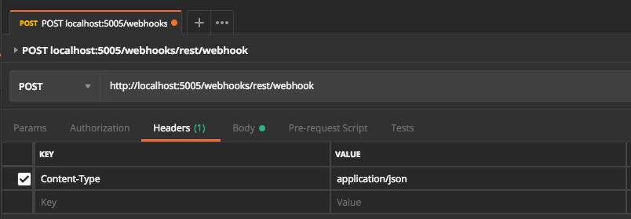
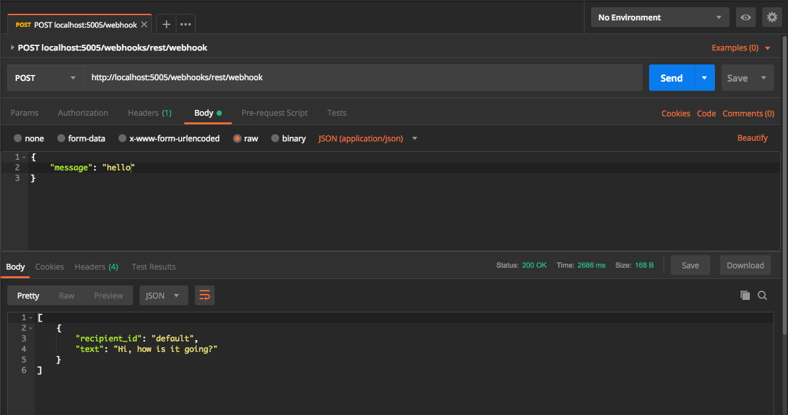

# Building RASA with DOCKER
[Rasa Reference](https://rasa.com/docs/core/docker_walkthrough/)

Download the repo
```
git clone https://enzoi@github.com/enzoi/rasa-docker.git
cd rasa-docker
```

## 1. Install Docker
Docker is quite big so it will take some time to install
[Download](https://docs.docker.com/install/)

## 2. Update your Rasa training data in the directory(rasa-docker)
Update the files below as you want
- data/stories.md
- data/nlu.md
- domain.yml

## 3. Train the Rasa Core Model
Run the code below on the terminal in the rasa-docker directory
```
docker run \
  -v $(pwd):/app/project \
  -v $(pwd)/models/rasa_core:/app/models \
  rasa/rasa_core:latest \
  train \
    --domain project/domain.yml \
    --stories project/data/stories.md \
    --out models
```

## 4. Train the NLU Model (Run the code below)
Run the code below on the terminal in the rasa-docker directory
```
docker run \
  -v $(pwd):/app/project \
  -v $(pwd)/models/rasa_nlu:/app/models \
  rasa/rasa_nlu:latest-spacy \
  run \
    python -m rasa_nlu.train \
    -c config.yml \
    -d project/data/nlu.md \
    -o models \
    --project current
```

## 5. Run Rasa Core and Rasa NLU
Run the code below on the terminal in the rasa-docker directory.
It will run Rasa server on your local machine.
```
docker-compose up
```

## 6. Send message to the chatbot which is available on http://localhost:5005
You can choose to send messages via either curl message on the terminal or REST api tools such as Postman

a. Run the code below
```
curl --request POST \
  --url http://localhost:5005/webhooks/rest/webhook \
  --header 'content-type: application/json' \
  --data '{
    "message": "hello"
  }'
```

b. Use Postman to send messages
[Download](https://www.getpostman.com/downloads/)


